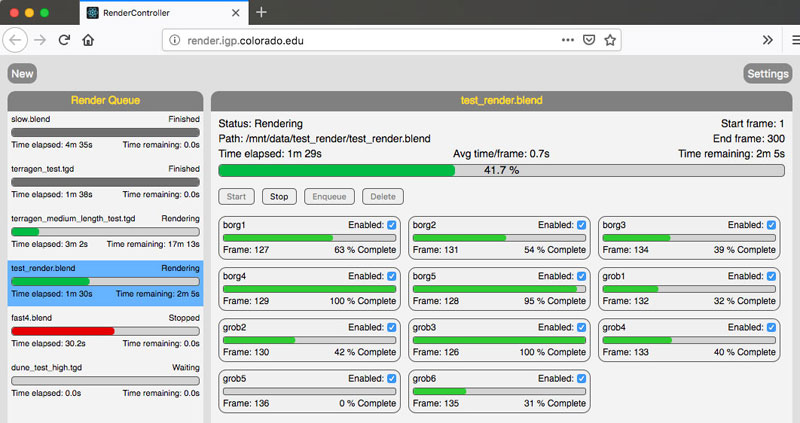

# RenderController
RenderController is a simple render farm manager that works with Blender's Cycles and Eevee render engines and Terragen 3.  It consists of a backend service written in Python and a React web frontend.

## Basic Features
* Supports Linux and MacOS render nodes.
* Simple browser-based user interface.
* Support for Cycles and Eevee render engines in Blender, as well as Terragen 3. Can be extended to work with any render engine that can be started from the command line.
* Queue as many renders as you want and they'll automatically start one at a time.
* If a render node fails, its frames will automatically be assigned to other nodes.
* Can manage nodes across multiple networks as long as they're reachable by SSH.
* Includes a `framechecker` script to check directories for missing frames.

## Backend Service Setup
### Requirements
* Linux or MacOS
* Python 3.6+
* Pip for Python 3

### System Prerequisites
#### SSH
Render controller uses SSH to communicate with render nodes.  You must configure your render nodes with SSH keys so that the server is able to log in without a password.  If you use an SSH config file to define your hostnames and connection properties, you should ensure the hostnames match the ones in the Render controller config file.  If you are attempting to access nodes outside of your local network, you may also need to configure firewall rules to allow incoming SSH connections from the server. It's not a bad idea to create a new user specifically for this purpose, and you can restrict its permissions to only what is necessary to start and kill render processes.

#### Shared Filesystem
The server also expects the render project files to be located in the same location on every node.  The server has no file handling capabilities of it's own, so it is assumed that you will use some kind of shared storage between the render nodes. Although shared storage is not strictly required, if you choose not to use it you will have to manually place project files on each node and retrieve the rendered frames when they're done.  The file browser in the web UI also accesses the local filesystem on the *server*, not the user's local machine, so you will have to synchronize that as well.  It is far easier to just use a shared filesystem of some kind mounted in the same location on every node.  Since we're already using SSH for the render processes, SSHFS is a simple and effection option, but any network filesystem will do.

### Python Dependencies
* pyyaml
* pytest (only required if you intend to run unit tests)

### Installation
1. Install Dependencies
    * RHEL/CentOS 7: `yum install python36 python36-pip`
    * MacOS: `brew install python` or use the official installer from python.org.
1. Download and build the latest version
    * `git clone https://github.com/jbadson/render_controller.git`
    * `cd render_controller/python && pip3 setup.py sdist`
1. Install with pip
    * `pip3 install dist/rendercontroller-{version}.tar.gz`
1. Create the work directory and log file.
    * `mkdir /var/rendercontroller`
    * `touch /var/log/rendercontroller.log`
    * Make sure both are writable by the user that will run the server.
1. Edit `/etc/rendercontroller.conf` to specify your render nodes and paths to render engine executables.
1. Configure service to start on boot.
	* If using Linux with Systemd, there's a sample service file in `python/systemd/rendercontroller.service`.  It would be wise to add a `User=` entry and run the service as a non-root user.

## Web Client Setup
### Requirements
* nodejs 17.0.1+
* npm 8.1.0+
* A web server.  Nginx or Apache will work.  If you're only hosting this app and don't need any special features, [serve](https://github.com/zeit/serve) is a simple option.
** NOTE: Do not install this on a public-facing web server. There is no provision for access control or authentication and the security model assumes it is accessible only from trusted networks.

### Installation
1. Install Dependencies
    * RHEL/CentOS 7: Build nodejs from source or use one of the offical linux binaries from nodejs.org.  The RPM verion in EPEL is too old (as of Dec 2018).
    * MacOS: `brew install node`
1. Download the latest version
    * `git clone https://github.com/jbadson/render_controller.git`
1. Edit `.env.production` with the correct host and port for your backend API.
1. Build the production package
    * `cd render_controller/react && npm run build`
1. Copy contents of the `build` directory to a suitable place and start your web server. For details, see the official docs on [deploying a React app](https://facebook.github.io/create-react-app/docs/deployment).

## Important Things to Know
### Project File Considerations
Because your project will be rendered in parallel on multiple nodes, you must ensure that the file paths to all linked objects (textures, imports, etc) are located in the same place on every node.  The easiest way to do this is to keep all of your project dependencies on shared storage (see above) that is accessible from all nodes.  If you're unable to do that (e.g. you want to edit projects on a fast local SSD), then always use relative file paths for all linked dependencies and don't forget to copy your dependencies to shared storage before rendering.  You should also configure your project files to save render output to a location on shared storage or you will have to have some other way of retrieving rendered frames.

### Multiple Render Passes
If your project file includes multiple passes or layers, the render node progress bars in the web UI may go to 100% for each pass.  This does not affect the overall render progress bar or indicate a problem with the render.  It happens because the server reads progress directly from the command line output and does not examine the project file to determine how many layers it might have.  The server only uses this progress information for showing the progress bar in the web UI.  Frame completion is not registered until a frame is saved to disk.

### Stopped Renders and the Render Queue
When a render has been manually stopped by a user, it is assigned the status `Stopped`.  This means that the render can only be restarted manually.  If you want to place the job back in queue to be rendered automatically, use the `Return to Queue` button to reset the status to `Waiting`.

## REST API Reference

Endpoint | Description
---- | ----
/job/new | Start a new job
/job/info | Detailed status information for all jobs on server
/job/info/{job_id} | Detailed status information for a given job
/job/start/{job_id} | Start a given job
/job/stop/{job_id} | Stop a given job
/job/delete/{job_id} | Remove a given job from the server
/job/reset_status/{job_id} | Reset a `Stopped` job to `Waiting` so it can be started automatically.
/node/list | List render nodes
/node/enable/{node\_name}/{job_id} | Enable a render node for a given job
/node/disable/{node\_name}/{job_id} | Disable a render node for a given job
/storage/ls | List the contents of a directory on shared storage. Access is restricted to contents of the `filesystem_base_dir` set in the config file.
/config/autostart | Returns autostart state
/config/autostart/enable | Enables autostart
/config/autostart/disable | Disables autostart

## History
I started writing this software in early 2014 while working for a small scientific animation group at the University of Colorado. I was interested in learning to code and we needed something to help us distribute frames to our render machines, so this seemed like a good first project. Although it served its purpose well, the code quality is what you'd expect from a total beginner. It really should be rewritten from the ground up, but I moved on from that job in early 2016 and the project went on hiatus.

The animation group was resurrected in 2019, and I have made an effort to gradually improve this project since then.  As far as I'm aware, nobody outside the group is using this software so I tend not to pay much attention to introducing breaking changes.  If anyone is using it, please let me know and I will take that into account.
