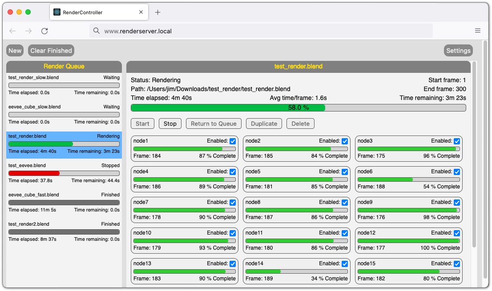

# RenderController
RenderController is a simple render farm manager that works with Blender's Cycles and Eevee render engines, as well as Terragen 3.  RenderController allows you to queue up as many renders as you like, and it will automatically start each one in the order it was created.  While rendering, RenderController distributes frames to each of your render nodes in parallel, tracks their progress, then assigns new frames as soon as nodes becomes available.

RenderController consists of a backend service written in Python and a browser-based user interface written in ReactJS.

## Basic Features
* Supports Linux and MacOS render nodes.
* Simple browser-based user interface.
* Works with Blender Cycles, Blender Eevee, and Terragen 3.
* Can be (relatively) easily extended to work with any other render engine that can run from the command line.
* Queue as many renders as you want and they'll automatically start one at a time.
* If a render node fails, its frames will automatically be assigned to other nodes.
* Can manage nodes across multiple networks as long as they're reachable by SSH.
* Includes a `framechecker` script to check directories for missing frames.

## Installation
### Prerequisites
#### SSH
Render controller uses SSH to communicate with render nodes.  You must configure your render nodes with SSH keys so that the server is able to log in without a password.  The hostnames in the `rendercontroller.conf` file must match the SSH hostnames.  If you need to configure the SSH user, key file, etc., use a ~/.ssh/config file for the user running the server process.  If you are attempting to access nodes outside of your local network, you may also need to configure firewall rules to allow incoming SSH connections from the server. It's not a bad idea to create a new user specifically for this purpose, and you can restrict its permissions to only what is necessary to start and kill render processes.

#### Shared Filesystem
The server also expects the render project files to be found in the same location on every node.  The server has no file handling capabilities of its own, so it is assumed that you will use some kind of shared storage that is mounted at the same place on every node and on the server. Although shared storage is not strictly required, if you choose not to use it you will have to manually place project files on each node and retrieve the rendered frames when they're done.  The file browser in the web UI also accesses the local filesystem on the *server*, not the user's local machine (see below), so you will have to synchronize that as well.  It is far easier to just use a shared filesystem of some kind.  Since we're already using SSH for the render processes, SSHFS is a simple and effective option, but any network filesystem will do.

### Backend Service Setup
#### Requirements
* Linux or MacOS
* Python 3.6+
* Pip for Python 3

#### Python Dependencies
* pyyaml
* pytest (only if you want to run unit tests)

#### Installation

> __WARNING: Do not expose the REST API to the public internet. There are no provisions for access control or authentication, and the security model assumes it is accessible only from trusted networks.__
 
1. Install Dependencies
    * RHEL/CentOS 7: `yum install python36 python36-pip`
    * MacOS: `brew install python` or use the official installer from python.org.
1. Download and build the latest version
    * `git clone https://github.com/jbadson/render_controller.git`
    * `cd render_controller/python && pip3 setup.py sdist`
    * Note: The `master` branch always represents the latest stable version, and may include hotfixes that haven't yet been rolled into a minor release.  If you prefer to pin to a specific release version, check out the corresponding `release/##` branch instead.
1. Install with pip
    * `pip3 install dist/rendercontroller-{version}.tar.gz`
1. Create the work directory and log file.
    * `mkdir /var/rendercontroller`
    * `touch /var/log/rendercontroller.log`
    * Make sure both are writable by the user that will run the server.
1. Edit `/etc/rendercontroller.conf` to specify your render nodes, shared storage mount point, and paths to render engine executables.
1. Configure service to start on boot.
	* If you're hosting this on Linux, there's a sample systemd service file in `python/systemd/rendercontroller.service`.  You may have to modify it according to your local environment.

### Web Interface Setup
#### Requirements
* nodejs 10.14+
* npm 6.14+
* A web server.  Nginx or Apache will work.  If you're only hosting this app and don't need any special features, [serve](https://github.com/zeit/serve) is a simple option.

#### Installation
> __WARNING: Do not install this on a public-facing web server. There are no provisions for access control or authentication, and the security model assumes it is accessible only from trusted networks.__
1. Install Dependencies
    * Linux: See if a suitable version is available from through your OS [package manager](https://nodejs.org/en/download/package-manager/).  If not, you may need to build from source.
    * MacOS: `brew install node`
1. Download the latest version
    * `git clone https://github.com/jbadson/render_controller.git`
    * Note: The `master` branch always represents the latest stable version, and may include hotfixes that haven't yet been rolled into a minor release.  If you prefer to pin to a specific release version, check out the corresponding `release/##` branch instead.
1. Edit `.env.production` with the correct host and port for your backend API.
1. Build the production package
    * `cd render_controller/react && npm run build`
1. Copy contents of the `build` directory to a suitable place and start your web server. For details, see the official docs on [deploying a React app](https://facebook.github.io/create-react-app/docs/deployment).

## Usage Considerations
The basic usage of RenderController should be fairly straightforward, but there are a few things to be aware of.
### Project File Setup
Because your project will be rendered in parallel on multiple nodes, the file paths to all linked objects (textures, imports, etc) must be the same on every node.  The easiest way to do this is to keep all of your project dependencies on shared storage (see above) that is accessible from all nodes.  If you're unable to do that (e.g. you want to edit projects on a fast local SSD), then always use relative file paths for all linked dependencies and don't forget to copy the latest versions of your dependencies to shared storage before rendering.  You should also configure your project files to save render output to a location on shared storage or you will have to have some other way of retrieving rendered frames.

### Browsing for Files in Web UI
When creating a new render job, the `Browse` button probably does not do what you expect.  Because render projects often consist of a large number of files and most 3D software does not enforce any sort of project structure, it's difficult to anticipate how users might organize their projects.  And since RenderController expects all render nodes to have access to [shared storage](#Shared Filesystem) anyway, we sidestep this complexity by __restricting the file browser to the contents of shared storage *as seen by the RenderController server*, not the user's local machine.__ RenderController does not move or modify project files at all. The browser is simply a way to specify the path to files that should already be accessible on the render nodes.  The assumption is that every render node, the server, and the user's workstation all have the shared filesystem mounted in the same location.  If so, this will be transparent because all project paths will be the same everywhere.  If you choose not to work from the shared filesystem, you will have to copy you project and all of its dependencies with relative paths intact to the shared filesystem using SSH, NFS, FTP, or whatever method you prefer before RenderController will be able to see it.

### Multiple Render Passes
If your project file includes multiple passes or layers, the render node progress bars in the web UI may go to 100% for each pass.  This does not affect the overall render progress bar or indicate a problem with the render.  It happens because the server reads progress directly from the command line output and does not examine the project file to determine how many layers it might have.  The server only uses this progress information for showing the progress bars in the web UI.  Frame completion is not registered until a frame is saved to disk.

### Stopped Renders and the Render Queue
When a render has been manually stopped by a user, it is assigned the status `Stopped`.  This means that the render can only be re-started manually.  If you want to place the job back in queue to be rendered automatically, use the `Return to Queue` button to reset the status to `Waiting`.

### Disabling a Node While Rendering
If you disable a render node while it is actively rendering a frame, that frame will be allowed to finish but no new frames will be assigned to the node.

## REST API Reference
The REST API is used by the web interface to interact with the backend service.  You may use the API directly if you wish to interact with RenderController from the command line or through scripts.

Endpoint | Description
---- | ----
/job/new | Start a new job
/job/info | Detailed status information for all jobs on server
/job/info/{job\_id} | Detailed status information for a given job
/job/start/{job\_id} | Start a given job
/job/stop/{job\_id} | Stop a given job
/job/delete/{job\_id} | Remove a given job from the server
/job/reset\_status/{job\_id} | Reset a `Stopped` job to `Waiting` so it can be started automatically.
/node/list | List render nodes
/node/enable/{node\_name}/{job\_id} | Enable a render node for a given job
/node/disable/{node\_name}/{job\_id} | Disable a render node for a given job
/storage/ls | List the contents of a directory on shared storage. Access is restricted to contents of the `filesystem_base_dir` set in the config file.
/config/autostart | Returns autostart state
/config/autostart/enable | Enables autostart
/config/autostart/disable | Disables autostart

## History
I started writing this software in early 2014 while working for a small scientific animation group at the University of Colorado. I was interested in learning to code and we needed something to help us distribute frames to our render machines, so this seemed like a good first project. Although it served its purpose well, the code quality is what you'd expect from a total beginner. It really should be rewritten from the ground up, but I moved on from that job in early 2016 and the project went on hiatus.

The animation group was resurrected in 2019, and I have made an effort to gradually improve this project since then.  As far as I'm aware, nobody outside the group is using this software so I tend not to pay much attention to introducing breaking changes.  If anyone is using it, please let me know and I will take that into account.
